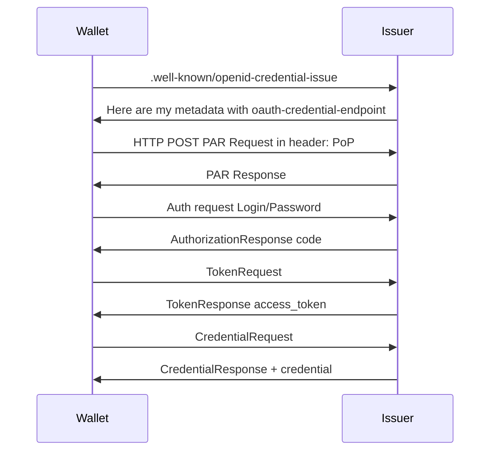

```mermaid
sequenceDiagram
Wallet->>Issuer: .well-known/openid-credential-issue
Issuer->>Wallet: Here are my metadata with oauth-credential-endpoint
Wallet->>Issuer: HTTP POST PAR Request in header: PoP
Issuer->>Wallet: PAR Response
Wallet->>Issuer: Auth request Login/Password

Issuer->>Wallet: AuthorizationResponse code
Wallet->>Issuer: TokenRequest
Issuer->>Wallet: TokenResponse access_token
Wallet->>Issuer: CredentialRequest
Issuer->>Wallet: CredentialResponse + credential 


```
