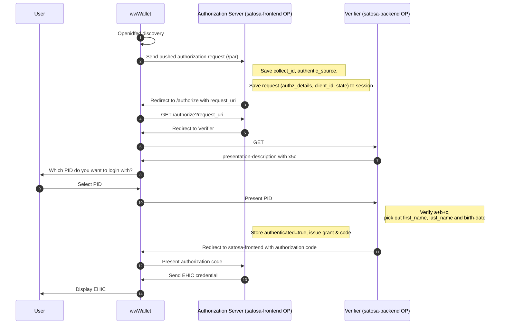

```mermaid
sequenceDiagram
  participant User as User
  participant Client as wwWallet
  participant OP as Authorization Server (satosa-frontend OP)
  participant Verifier as Verifier (satosa-backend OP)

  autonumber
  Client ->> Client: Openidfed discovery
  Client ->> OP: Send pushed authorization request (/par)
  note right of OP: Save collect_id, authentic_source, 
  Note right of OP: Save request (authz_details, client_id, state) to session
  OP ->> Client: Redirect to /authorize with request_uri
  Client ->> OP: GET /authorize?request_uri
  OP ->> Client: Redirect to Verifier
  Client ->> Verifier: GET 
  Verifier ->> Client: presentation-description with x5c
  Client ->> User: Which PID do you want to login with?
  User ->> Client: Select PID
  Client ->> Verifier: Present PID
  note right of Verifier: Verify a+b+c,<br> pick out first_name, last_name and birth-date
  Note right of OP: Store authenticated=true, issue grant & code
  Verifier ->> Client: Redirect to satosa-frontend with authorization code
  Client ->> OP: Present authorization code
  OP ->> Client: Send EHIC credential
  Client ->> User: Display EHIC
```
