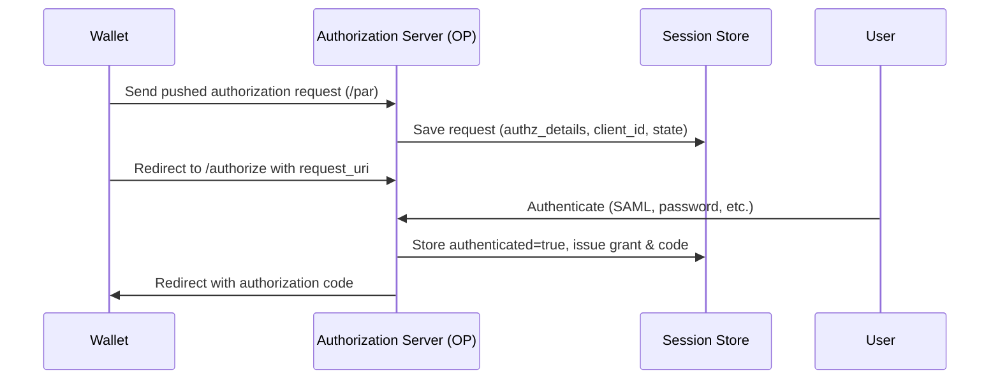

## Authorization Flow (PAR)

```mermaid
sequenceDiagram
    participant Client as Wallet
    participant OP as Authorization Server (OP)
    participant Session as Session Store
    participant User as User

    Client ->> OP: Send pushed authorization request (/par)
    OP ->> Session: Save request (authz_details, client_id, state)
    Client ->> OP: Redirect to /authorize with request_uri
    User ->> OP: Authenticate (SAML, password, etc.)
    OP ->> Session: Store authenticated=true, issue grant & code
    OP ->> Client: Redirect with authorization code

```
